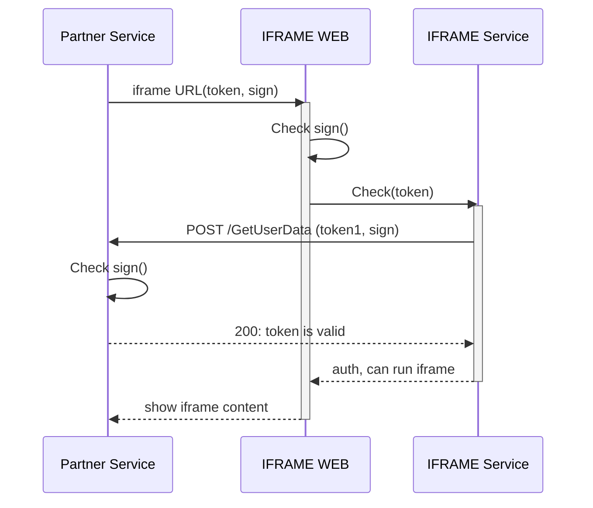

```mermaid
sequenceDiagram
  participant P as Partner Service
  participant IW as IFRAME WEB
  participant IS as IFRAME Service


  P->>IW: iframe URL(token, sign)
  
  activate IW
  IW->>IW: Check sign()
  IW->>IS: Check(token)
  
  activate IS
  IS->>P: POST /GetUserData (token1, sign)

  P->>P: Check sign()
  P-->>IS: 200: token is valid

  IS-->>IW: auth, can run iframe
  deactivate IS

  IW-->>P: show iframe content
  deactivate IW
```
